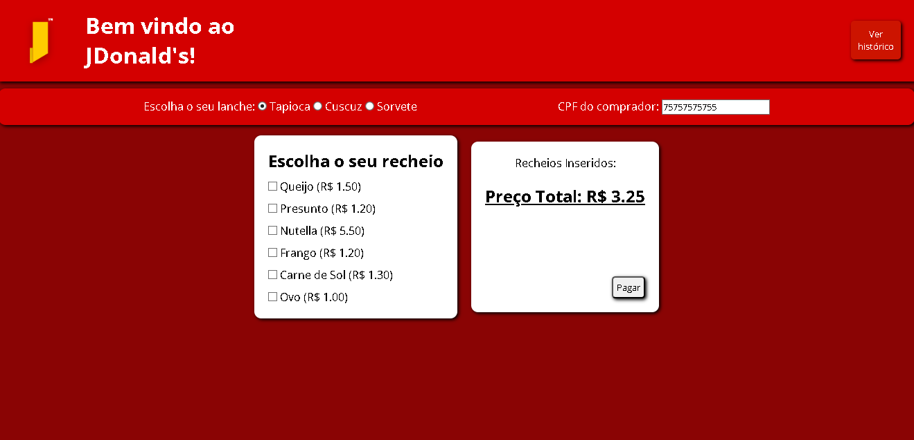
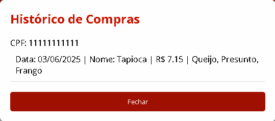

# Projeto JDonalds

Este projeto utiliza uma abordagem FullStack, usando Banco de Dados (pgAdmin), juntamente 
do Back-End e o Front-End.

## Design do Projeto

### Interface principal do Projeto

### Interface(Modal) do Histórico

## Funcionalidades

- [X] Filtra os alimentos e os recheios
    - [X] Tapioca
    - [X] Cuscuz
    - [X] Sorvete
- [X] Possui um input para CPF
- [X] Preço total da comida, juntamente dos recheios
- [X] Botão de pagamento que envia as informações da compra para o banco de dados
- [X] Modal de confirmação do pagamento
- [X] Histórico que mostra as compras relacionadas ao CPF do comprador

## Contatos

Email: joaop.dev.oliveira@gmail.com